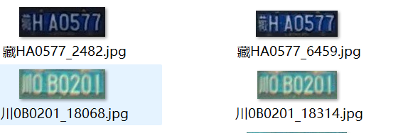

# 车牌识别

中文车牌识别系统基于crnn

## 环境配置

1. WIN 10 or Ubuntu 16.04
2. **PyTorch > 1.2.0 (may fix ctc loss)**🔥
3. yaml
4. easydict
5. tensorboardX

## 数据

#### 车牌识别数据集CCPD+CRPD

1. 从CCPD和CRPD截下来的车牌小图以及我自己收集的一部分车牌 [dataset](https://pan.baidu.com/s/1xT-F3E5U3ul3o6gu6Zk94g)  提取码：g08q
2. 数据集打上标签,生成train.txt和val.txt
   

   图片命名如上图
   然后执行如下命令，得到train.txt和val.txt

   ```
   python plateLabel.py --image_path your/train/img/path/ --label_file datasets/train.txt
   python plateLabel.py --image_path your/val/img/path/ --label_file datasets/val.txt
   ```

   数据格式如下：

   train.txt

   ```
   /mnt/Gu/trainData/plate/new_git_train/CCPD_CRPD_ALL/冀BAJ731_3.jpg 5 53 52 60 49 45 43 
   /mnt/Gu/trainData/plate/new_git_train/CCPD_CRPD_ALL/冀BD387U_2454.jpg 5 53 55 45 50 49 70 
   /mnt/Gu/trainData/plate/new_git_train/CCPD_CRPD_ALL/冀BG150C_3.jpg 5 53 58 43 47 42 54 
   /mnt/Gu/trainData/plate/new_git_train/CCPD_CRPD_OTHER_ALL/皖A656V3_8090.jpg 13 52 48 47 48 71 45 
   /mnt/Gu/trainData/plate/new_git_train/CCPD_CRPD_OTHER_ALL/皖C91546_7979.jpg 13 54 51 43 47 46 48 
   /mnt/Gu/trainData/plate/new_git_train/CCPD_CRPD_OTHER_ALL/皖G88950_1540.jpg 13 58 50 50 51 47 42 
   /mnt/Gu/trainData/plate/new_git_train/CCPD_CRPD_OTHER_ALL/皖GX9Y56_2113.jpg 13 58 73 51 74 47 48 
   ```
3. 将train.txt  val.txt路径写入lib/config/360CC_config.yaml 中

   ```
   DATASET:
     DATASET: 360CC
     ROOT: ""
     CHAR_FILE: 'lib/dataset/txt/plate2.txt'
     JSON_FILE: {'train': 'datasets/train.txt', 'val': 'datasets/val.txt'}
   ```

## Train

```angular2html
   [run] python train.py --cfg lib/config/360CC_config.yaml
```

结果保存再output文件夹中

## 测试demo

```

python my_demo_new.py --model_path saved_model/best.pth --image_path images/test.jpg
                                   or your/model/path
```


结果是：


## 导出onnx
```

python exportonnx.py --image_path images/test.jpg  --checkpoint saved_model/best.pth

```
导出onnx文件为 saved_model/best.onnx
## 双层车牌
双层车牌这里采用拼接成单层车牌的方式：
```
def get_split_merge(img):
    h,w,c = img.shape
    img_upper = img[0:int(5/12*h),:]
    img_lower = img[int(1/3*h):,:]
    img_upper = cv2.resize(img_upper,(img_lower.shape[1],img_lower.shape[0]))
    new_img = np.hstack((img_upper,img_lower))
    return new_img
```

  通过变换得到 


## References

- https://github.com/meijieru/crnn.pytorch
