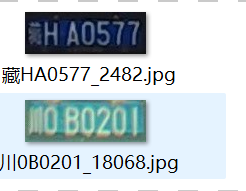
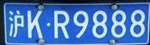
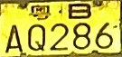
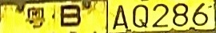

# 车牌识别

**车牌检测+车牌识别 看这里[车牌检测识别](https://github.com/we0091234/Chinese_license_plate_detection_recognition)**

**车牌颜色和车牌识别一起训练看这里： [车牌识别+车牌颜色](https://github.com/we0091234/crnn_plate_recognition/tree/plate_color)**


训练的时候 选择相应的cfg 即可选择模型的大小

train.py

```
 # construct face related neural networks
    #cfg =[8,8,16,16,'M',32,32,'M',48,48,'M',64,128] #small model
    # cfg =[16,16,32,32,'M',64,64,'M',96,96,'M',128,256]#medium model
    cfg =[32,32,64,64,'M',128,128,'M',196,196,'M',256,256] #big model
    model = myNet_ocr(num_classes=len(plate_chr),cfg=cfg)
```

## 环境配置

1. WIN 10 or Ubuntu 16.04
2. **PyTorch > 1.2.0 (may fix ctc loss)**🔥
3. yaml
4. easydict
5. tensorboardX

## 数据

#### 车牌识别数据集CCPD+CRPD

1. 从CCPD和CRPD截下来的车牌小图以及我自己收集的一部分车牌 有需要的话加qq群获取:823419837
2. 数据集打上标签,生成train.txt和val.txt

   

   图片命名如上图：**车牌号_序号.jpg**
   然后执行如下命令，得到train.txt和val.txt

   ```
   python plateLabel.py --image_path your/train/img/path/ --label_file datasets/train.txt
   python plateLabel.py --image_path your/val/img/path/ --label_file datasets/val.txt
   ```

   数据格式如下：

   train.txt

   ```
   /mnt/Gu/trainData/plate/new_git_train/CCPD_CRPD_ALL/冀BAJ731_3.jpg 5 53 52 60 49 45 43 
   /mnt/Gu/trainData/plate/new_git_train/CCPD_CRPD_ALL/冀BD387U_2454.jpg 5 53 55 45 50 49 70 
   /mnt/Gu/trainData/plate/new_git_train/CCPD_CRPD_ALL/冀BG150C_3.jpg 5 53 58 43 47 42 54 
   /mnt/Gu/trainData/plate/new_git_train/CCPD_CRPD_OTHER_ALL/皖A656V3_8090.jpg 13 52 48 47 48 71 45 
   /mnt/Gu/trainData/plate/new_git_train/CCPD_CRPD_OTHER_ALL/皖C91546_7979.jpg 13 54 51 43 47 46 48 
   /mnt/Gu/trainData/plate/new_git_train/CCPD_CRPD_OTHER_ALL/皖G88950_1540.jpg 13 58 50 50 51 47 42 
   /mnt/Gu/trainData/plate/new_git_train/CCPD_CRPD_OTHER_ALL/皖GX9Y56_2113.jpg 13 58 73 51 74 47 48 
   ```
3. 将train.txt  val.txt路径写入lib/config/360CC_config.yaml 中

   ```
   DATASET:
     DATASET: 360CC
     ROOT: ""
     CHAR_FILE: 'lib/dataset/txt/plate2.txt'
     JSON_FILE: {'train': 'datasets/train.txt', 'val': 'datasets/val.txt'}
   ```

## Train

```angular2html
python train.py --cfg lib/config/360CC_config.yaml
```

结果保存再output文件夹中

## 测试demo

```

python demo.py --model_path saved_model/best.pth --image_path images/test.jpg
                                   or your/model/path
```



结果是：


## 导出onnx

```

python export.py --weights saved_model/best.pth --save_path saved_model/best.onnx  --simplify

```


#### onnx 推理

```
python onnx_infer.py --onnx_file saved_model/best.onnx  --image_path images/test.jpg
```

## 双层车牌

双层车牌这里采用拼接成单层车牌的方式：

python:

```
def get_split_merge(img):
    h,w,c = img.shape
    img_upper = img[0:int(5/12*h),:]
    img_lower = img[int(1/3*h):,:]
    img_upper = cv2.resize(img_upper,(img_lower.shape[1],img_lower.shape[0]))
    new_img = np.hstack((img_upper,img_lower))
    return new_img
```

c++:

```
cv::Mat get_split_merge(cv::Mat &img)   //双层车牌 分割 拼接
{
    cv::Rect  upper_rect_area = cv::Rect(0,0,img.cols,int(5.0/12*img.rows));
    cv::Rect  lower_rect_area = cv::Rect(0,int(1.0/3*img.rows),img.cols,img.rows-int(1.0/3*img.rows));
    cv::Mat img_upper = img(upper_rect_area);
    cv::Mat img_lower =img(lower_rect_area);
    cv::resize(img_upper,img_upper,img_lower.size());
    cv::Mat out(img_lower.rows,img_lower.cols+img_upper.cols, CV_8UC3, cv::Scalar(114, 114, 114));
    img_upper.copyTo(out(cv::Rect(0,0,img_upper.cols,img_upper.rows)));
    img_lower.copyTo(out(cv::Rect(img_upper.cols,0,img_lower.cols,img_lower.rows)));
    return out;
}
```

  通过变换得到 

## 训练自己的数据集

1. 修改alphabets.py，修改成你自己的字符集，plateName,plate_chr都要修改，plate_chr 多了一个空的占位符'#'
2. 通过plateLabel.py 生成train.txt, val.txt
3. 训练

## 数据增强

```
cd Text-Image-Augmentation-python-master

python demo1.py --src_path /mnt/Gu/trainData/test_aug --dst_path /mnt/Gu/trainData/result_aug/
```

src_path 是数据路径， dst_path是保存的数据路径

**然后把两份数据放到一起进行训练，效果会好很多！**

## References

- https://github.com/meijieru/crnn.pytorch
- [https://github.com/Sierkinhane/CRNN_Chinese_Characters_Rec](https://github.com/Sierkinhane/CRNN_Chinese_Characters_Rec)

#### 联系

**有问题可以提issues 或者加qq群:823419837 询问**
