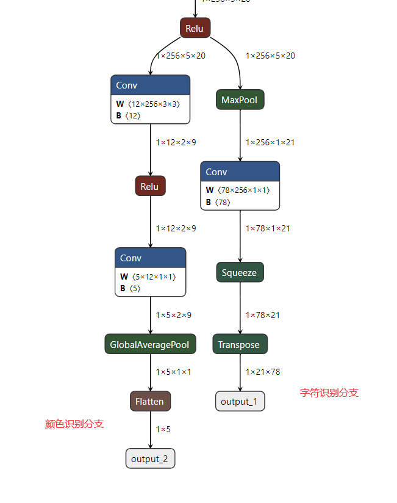

# 车牌识别+车牌颜色

车牌识别+车牌颜色用一个模型如图所示，右边是我们已经训练好的车牌字符识别模型([训练方法看这里](https://github.com/we0091234/crnn_plate_recognition))，只需训练左边边颜色分支即可。



## 训练颜色分支

1. 下载[车牌颜色数据集](https://pan.baidu.com/s/1YtuYQUtqtmKrQmbpmvMayw)(提取码:sbqn),准备自己的数据集
2. 准备你训练好的车牌字符识别模型，或者我训练好的模型[看这里](https://github.com/we0091234/crnn_plate_recognition)，即plate_rec.pth
3. 训练

   ```
   python train_fix_color.py --weights saved_model/plate_rec.pth --train_path datasets/train  --val_path datasets/val --model_path color_model

   ```

   结果保存再color_model文件夹中

## 测试demo

```

python demo_plate_color.py --model_path saved_model/plate_rec_color.pth --image_path images/test.jpg
     
```


结果是：

T.png)

## 导出onnx

```

python export.py --weights saved_model/plate_rec_color.pth saved_model/plate_rec_color.onnx  --simplify

```

#### onnx 推理

```
python onnx_infer.py --onnx_file saved_model/plate_rec_color.onnx  --image_path images/test.jpg
```

#### 联系

**有问题可以提issues 或者加qq群:871797331 询问**
